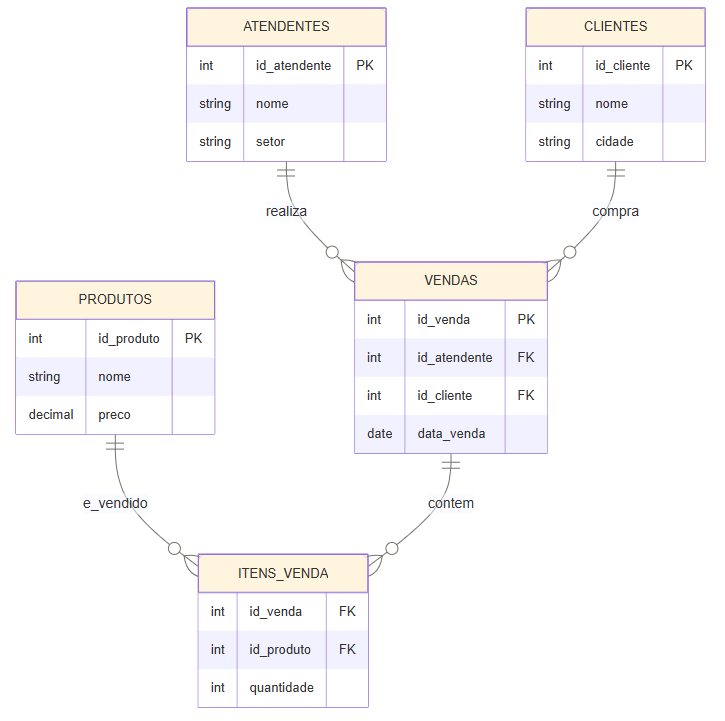

# Projeto_SQL_Data_Base_Loja
Este é um projeto fictício em SQL para criação de um banco de dados para uma loja de informática levando em consideração a estrutura da loja.

Tal projeto foi criado usando o PgAmin e tem sua estrutura 4 tabelas que se relacionam entre si, chamadas de Atendentes, Clientes, Vendas, Itens venda e Produtos, lembre-se que como elas se relacionam, futuramente para adicionar dados, deve-se atentar nas fases corretas de inserção. 
atendentes → clientes → estoque → vendas → itens_venda.

